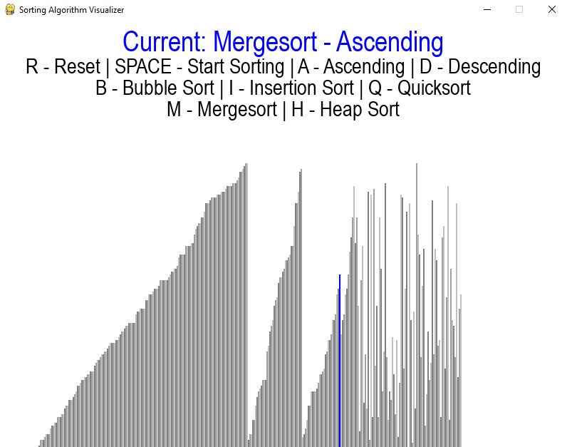

# Sorting-Algorithms-Visualizer
## Description
Python program which is used to visualize the sorting process of different algorithms. The visualizer itself is based on a project of "Tech with Tim", with pygame. The sorting algorithms implementation is mine.

The sorting algorithms implemented are:
1. Bubble Sort
2. Insertion Sort
3. Quicksort
4. Mergesort
5. Heap Sort

